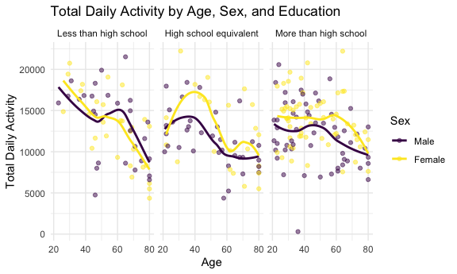
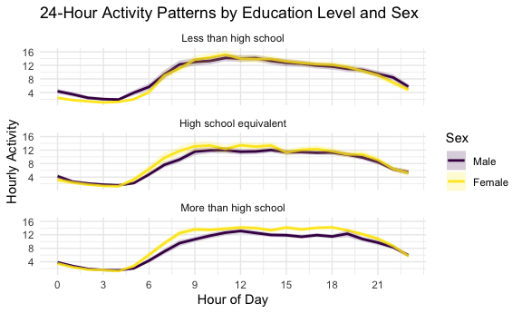

p8105_hw3_YZ5290
================
2025-10-13

Problem 1

``` r
library(tidyverse)
```

    ## ── Attaching core tidyverse packages ──────────────────────── tidyverse 2.0.0 ──
    ## ✔ dplyr     1.1.4     ✔ readr     2.1.5
    ## ✔ forcats   1.0.0     ✔ stringr   1.5.1
    ## ✔ ggplot2   4.0.0     ✔ tibble    3.2.1
    ## ✔ lubridate 1.9.4     ✔ tidyr     1.3.1
    ## ✔ purrr     1.0.2     
    ## ── Conflicts ────────────────────────────────────────── tidyverse_conflicts() ──
    ## ✖ dplyr::filter() masks stats::filter()
    ## ✖ dplyr::lag()    masks stats::lag()
    ## ℹ Use the conflicted package (<http://conflicted.r-lib.org/>) to force all conflicts to become errors

``` r
library(patchwork)
knitr::opts_chunk$set(
  fig.width = 6,
  fig.asp = .6,
  out.width = "90%"
)

theme_set(theme_minimal() + theme(legend.position = "bottom"))

options(
  ggplot2.continuous.colour = "viridis",
  ggplot2.continuous.fill = "viridis"
)

scale_colour_discrete = scale_colour_viridis_d
scale_fill_discrete = scale_fill_viridis_d
```

``` r
library(p8105.datasets)
data("instacart")
```

``` r
instacart
```

    ## # A tibble: 1,384,617 × 15
    ##    order_id product_id add_to_cart_order reordered user_id eval_set order_number
    ##       <int>      <int>             <int>     <int>   <int> <chr>           <int>
    ##  1        1      49302                 1         1  112108 train               4
    ##  2        1      11109                 2         1  112108 train               4
    ##  3        1      10246                 3         0  112108 train               4
    ##  4        1      49683                 4         0  112108 train               4
    ##  5        1      43633                 5         1  112108 train               4
    ##  6        1      13176                 6         0  112108 train               4
    ##  7        1      47209                 7         0  112108 train               4
    ##  8        1      22035                 8         1  112108 train               4
    ##  9       36      39612                 1         0   79431 train              23
    ## 10       36      19660                 2         1   79431 train              23
    ## # ℹ 1,384,607 more rows
    ## # ℹ 8 more variables: order_dow <int>, order_hour_of_day <int>,
    ## #   days_since_prior_order <int>, product_name <chr>, aisle_id <int>,
    ## #   department_id <int>, aisle <chr>, department <chr>

The dataset contains 138461 observations and 15 variables. Each
observation is a single product from an Instacart order. Key variables
include order_id: a different ID for each order; product_id: a different
ID for each product and product_name which is the name of the product.
The example product  
Bulgarian Yogurt has unique product id 49302 belong to yogurt aisel is
in order id 1 and has reordered once.

``` r
instacart|>
  count(aisle, sort = TRUE)
```

    ## # A tibble: 134 × 2
    ##    aisle                              n
    ##    <chr>                          <int>
    ##  1 fresh vegetables              150609
    ##  2 fresh fruits                  150473
    ##  3 packaged vegetables fruits     78493
    ##  4 yogurt                         55240
    ##  5 packaged cheese                41699
    ##  6 water seltzer sparkling water  36617
    ##  7 milk                           32644
    ##  8 chips pretzels                 31269
    ##  9 soy lactosefree                26240
    ## 10 bread                          23635
    ## # ℹ 124 more rows

There are 134 aisle in total and the most items ordered from fresh
vergetables.

``` r
instacart |>
  count(aisle, sort = TRUE) |>
  filter(n > 10000) |>
  mutate(aisle = fct_reorder(aisle, n)) |>
  ggplot(aes(x = n, y = aisle)) +
  geom_col(fill = "skyblue") +
  labs(
    title = "Number of Items Ordered by Aisle (>10,000 orders)",
    x = "Number of Items Ordered",
    y = "Aisle"
  )
```


``` r
top3tble=
  instacart |>
  filter(aisle %in% c("baking ingredients", "dog food care", "packaged vegetables fruits")) |>
  count(aisle, product_name, name = "num_orders") |>
  group_by(aisle) |>
  slice_max(order_by = num_orders, n = 3) |>
  ungroup()
top3tble
```

    ## # A tibble: 9 × 3
    ##   aisle                      product_name                             num_orders
    ##   <chr>                      <chr>                                         <int>
    ## 1 baking ingredients         Light Brown Sugar                               499
    ## 2 baking ingredients         Pure Baking Soda                                387
    ## 3 baking ingredients         Cane Sugar                                      336
    ## 4 dog food care              Snack Sticks Chicken & Rice Recipe Dog …         30
    ## 5 dog food care              Organix Chicken & Brown Rice Recipe              28
    ## 6 dog food care              Small Dog Biscuits                               26
    ## 7 packaged vegetables fruits Organic Baby Spinach                           9784
    ## 8 packaged vegetables fruits Organic Raspberries                            5546
    ## 9 packaged vegetables fruits Organic Blueberries                            4966

``` r
mean_hour_table=
  instacart |>
  filter(product_name %in% c("Pink Lady Apples", "Coffee Ice Cream")) |>
  group_by(product_name, order_dow) |>
  summarize(mean_hour = mean(order_hour_of_day), .groups = "drop") |>
  pivot_wider(
    names_from = order_dow,
    values_from = mean_hour,
    names_prefix = "Day"
  )
mean_hour_table
```

    ## # A tibble: 2 × 8
    ##   product_name      Day0  Day1  Day2  Day3  Day4  Day5  Day6
    ##   <chr>            <dbl> <dbl> <dbl> <dbl> <dbl> <dbl> <dbl>
    ## 1 Coffee Ice Cream  13.8  14.3  15.4  15.3  15.2  12.3  13.8
    ## 2 Pink Lady Apples  13.4  11.4  11.7  14.2  11.6  12.8  11.9

``` r
mean_hour_table |>
  rename(
    Sunday=Day0,
    Monday=Day1,
    Tuesday=Day2,
    Wednesday=Day3,
    Thursday=Day4,
    Friday=Day5,
    Saturday=Day6
  )
```

    ## # A tibble: 2 × 8
    ##   product_name     Sunday Monday Tuesday Wednesday Thursday Friday Saturday
    ##   <chr>             <dbl>  <dbl>   <dbl>     <dbl>    <dbl>  <dbl>    <dbl>
    ## 1 Coffee Ice Cream   13.8   14.3    15.4      15.3     15.2   12.3     13.8
    ## 2 Pink Lady Apples   13.4   11.4    11.7      14.2     11.6   12.8     11.9

problem2

``` r
zipcode=read_csv("data/zipcode.csv")|>
  janitor::clean_names()
```

    ## Rows: 322 Columns: 7
    ## ── Column specification ────────────────────────────────────────────────────────
    ## Delimiter: ","
    ## chr (4): County, County Code, File Date, Neighborhood
    ## dbl (3): State FIPS, County FIPS, ZipCode
    ## 
    ## ℹ Use `spec()` to retrieve the full column specification for this data.
    ## ℹ Specify the column types or set `show_col_types = FALSE` to quiet this message.

``` r
zori=read_csv("data/zori.csv")|>
  janitor::clean_names()
```

    ## Rows: 149 Columns: 125
    ## ── Column specification ────────────────────────────────────────────────────────
    ## Delimiter: ","
    ## chr   (6): RegionType, StateName, State, City, Metro, CountyName
    ## dbl (119): RegionID, SizeRank, RegionName, 2015-01-31, 2015-02-28, 2015-03-3...
    ## 
    ## ℹ Use `spec()` to retrieve the full column specification for this data.
    ## ℹ Specify the column types or set `show_col_types = FALSE` to quiet this message.

``` r
#clean data
zipcode_new=
  zipcode|>
  select(zip_code, county, neighborhood) |>
  distinct(zip_code, .keep_all = TRUE) |>
  mutate(zip_code = as.character(zip_code))

zori_new = 
  zori |>
  select(region_id, size_rank, region_name, region_type, 
         state_name, state, city, metro, county_name,
         x2015_01_31:x2024_08_31) |>
  pivot_longer(
    cols = x2015_01_31:x2024_08_31,
    names_to = "date_str",
    values_to = "rent_price"
  ) |>
  mutate(
    date_str_clean = str_remove(date_str, "^x") |> str_replace_all("_", "-"),
    date = as.Date(date_str_clean, format = "%Y-%m-%d"),
    zip_code = as.character(region_name)
  ) |>
  select(-date_str, -date_str_clean, -region_name)
```

``` r
final_data <- zori_new |>
  left_join(zipcode_new, by = "zip_code") |>
  select(zip_code, county, neighborhood, date, rent_price, everything()) |>
  arrange(zip_code, date)
```

\##count month

``` r
zip_obs_count=
  final_data |>
  group_by(zip_code) |>
  summarise(
    n_146 = n(),
    n_0 = sum(!is.na(rent_price))
  )

n_146_obs <- sum(zip_obs_count$n_146 == 116)
n_0_obs <- sum(zip_obs_count$n_0 < 10)
```

There are 149 zipcodes are observed 116 month and there are 26 zip code
observed fewer than 10 months. Some zipcodes reported monthly can have
data for 116 months. Some zipcode do not contain residential house like
unique university zipcode might not have rent price to report.

\##make a table (average rental price in each borough and year)

``` r
borough_t=
  final_data |>
  mutate(year = year(date)) |>
  filter(!is.na(county), !is.na(rent_price)) |>
  group_by(county, year) |>
  summarise(
    avg_rent = mean(rent_price, na.rm = TRUE),
    n_zips = n_distinct(zip_code),
    .groups = "drop"
  ) |>
  arrange(county, year)
reader_table=
  borough_t|>
  select(county, year, avg_rent) |>
  pivot_wider(
    names_from = year,
    values_from = avg_rent
  ) |>
  mutate(across(where(is.numeric), ~round(., 2)))
reader_table
```

    ## # A tibble: 5 × 11
    ##   county   `2015` `2016` `2017` `2018` `2019` `2020` `2021` `2022` `2023` `2024`
    ##   <chr>     <dbl>  <dbl>  <dbl>  <dbl>  <dbl>  <dbl>  <dbl>  <dbl>  <dbl>  <dbl>
    ## 1 Bronx     1760.  1520.  1544.  1639.  1706.  1811.  1858.  2054.  2285.  2497.
    ## 2 Kings     2493.  2520.  2546.  2547.  2630.  2555.  2550.  2868.  3015.  3126.
    ## 3 New York  3022.  3039.  3134.  3184.  3310.  3107.  3137.  3778.  3933.  4078.
    ## 4 Queens    2215.  2272.  2263.  2292.  2388.  2316.  2211.  2406.  2562.  2694.
    ## 5 Richmond    NA     NA     NA     NA     NA   1978.  2045.  2147.  2333.  2536.

\##comments on the trend: the rental price for each country increase
over year. New York has the highest rental price every year and bronx
has the lowest every year.

\#plot showing NYC Rental Prices within ZIP codes for all available
years. Your plot should facilitate comparisons across boroughs

``` r
plot1=
  final_data |>
  filter(!is.na(county), !is.na(rent_price)) |>
  mutate(year_month = floor_date(date, "month")) |>
  group_by(county, year_month) |>
  summarise(
    median_rent = median(rent_price, na.rm = TRUE),
    .groups = "drop"
  ) |>
  ggplot(aes(x = year_month, y = median_rent, color = county)) +
  geom_point(size=0.8) +
  labs(
    title = "NYC Rental Prices by Borough (2015-2024)",
    x = "Date", 
    y = "Median Rent",
    color = "Borough"
  ) +
  theme_minimal() +
  theme(legend.position = "bottom")
plot1
```


\##comment: Overall, the rent price increased from 2015 to 2024. But in
New York contry, rent pricedecerase from 2020 fall to 2021, which appear
to be a huge drop. This is not seen in the previous table. Bronx and
Queens also has a little drop in the same timee period.

\#Compute the average rental price within each ZIP code over each month
in 2023

``` r
zip_2023_avg=
  final_data|>
  mutate(year = year(date))|>
  filter(year == 2023, !is.na(rent_price), !is.na(county)) |>
  group_by(zip_code, county)|>
  summarise(
    avg_rent = mean(rent_price, na.rm = TRUE),
    .groups="drop"
  )

plot2=
  ggplot(zip_2023_avg, aes(x = avg_rent, y = county, fill = county))+
  geom_boxplot(alpha = 0.6) +
  labs(
    title = "Distribution of ZIP-code-level Rental Prices by Borough (2023)",
    x="Average Rent",
    y="Borough"
  )+
  theme_minimal()+
  theme(legend.position = "none")

plot2
```


\#comment: New York county has the highest average rental price with the
largest range. Kings the the second highest average rental price.
Richmond has lowest range. THe bronx has lowest average rental pricebut
richmond’s average rntal price is slight more than Bronx’s.

\#combine two graph and export.

``` r
combined_plot=
  plot1 /plot2


ggsave("result/nyc.png", combined_plot, 
       width = 12, height = 10)
```

\#Problem3

``` r
demo=
  read_csv("data/demo.csv",skip=4) |>
  janitor::clean_names()
```

    ## Rows: 250 Columns: 5
    ## ── Column specification ────────────────────────────────────────────────────────
    ## Delimiter: ","
    ## dbl (5): SEQN, sex, age, BMI, education
    ## 
    ## ℹ Use `spec()` to retrieve the full column specification for this data.
    ## ℹ Specify the column types or set `show_col_types = FALSE` to quiet this message.

``` r
acc=
  read_csv("data/acc.csv") |>
  janitor::clean_names()
```

    ## Rows: 250 Columns: 1441
    ## ── Column specification ────────────────────────────────────────────────────────
    ## Delimiter: ","
    ## dbl (1441): SEQN, min1, min2, min3, min4, min5, min6, min7, min8, min9, min1...
    ## 
    ## ℹ Use `spec()` to retrieve the full column specification for this data.
    ## ℹ Specify the column types or set `show_col_types = FALSE` to quiet this message.

``` r
#clean
demo_clean=
  demo |>
  filter(age>=21)|> 
  filter(!is.na(sex), !is.na(education)) |> 
  mutate(
    sex = factor(sex, levels=c(1, 2), labels =c("Male", "Female")),
    education = factor(education, 
                      levels=c(1, 2, 3),
                      labels=c("Less than high school", 
                                "High school equivalent", 
                                "More than high school"))
  )
demo_clean
```

    ## # A tibble: 231 × 5
    ##     seqn sex      age   bmi education             
    ##    <dbl> <fct>  <dbl> <dbl> <fct>                 
    ##  1 62161 Male      22  23.3 High school equivalent
    ##  2 62164 Female    44  23.2 More than high school 
    ##  3 62169 Male      21  20.1 High school equivalent
    ##  4 62174 Male      80  33.9 More than high school 
    ##  5 62177 Male      51  20.1 High school equivalent
    ##  6 62178 Male      80  28.5 High school equivalent
    ##  7 62180 Male      35  27.9 More than high school 
    ##  8 62184 Male      26  22.1 High school equivalent
    ##  9 62189 Female    30  22.4 More than high school 
    ## 10 62191 Male      70  NA   High school equivalent
    ## # ℹ 221 more rows

``` r
acc_long=
  acc |>
  pivot_longer(
    cols = min1:min1440,
    names_to = "minute",
    values_to = "mims_value"
  ) |>
  mutate(
    minute = as.numeric(str_remove(minute, "min")), 
    hour = floor((minute - 1) / 60)
  ) |>
  select(seqn, minute, hour, mims_value) 
acc_long
```

    ## # A tibble: 360,000 × 4
    ##     seqn minute  hour mims_value
    ##    <dbl>  <dbl> <dbl>      <dbl>
    ##  1 62161      1     0      1.11 
    ##  2 62161      2     0      3.12 
    ##  3 62161      3     0      1.47 
    ##  4 62161      4     0      0.938
    ##  5 62161      5     0      1.60 
    ##  6 62161      6     0      0.145
    ##  7 62161      7     0      2.10 
    ##  8 62161      8     0      0.509
    ##  9 62161      9     0      1.63 
    ## 10 62161     10     0      1.20 
    ## # ℹ 359,990 more rows

``` r
final_data=
  acc_long |>
  inner_join(demo_clean, by = "seqn") |>
  select(seqn, sex, age, bmi, education, minute, hour, mims_value, everything())
final_data
```

    ## # A tibble: 332,640 × 8
    ##     seqn sex     age   bmi education              minute  hour mims_value
    ##    <dbl> <fct> <dbl> <dbl> <fct>                   <dbl> <dbl>      <dbl>
    ##  1 62161 Male     22  23.3 High school equivalent      1     0      1.11 
    ##  2 62161 Male     22  23.3 High school equivalent      2     0      3.12 
    ##  3 62161 Male     22  23.3 High school equivalent      3     0      1.47 
    ##  4 62161 Male     22  23.3 High school equivalent      4     0      0.938
    ##  5 62161 Male     22  23.3 High school equivalent      5     0      1.60 
    ##  6 62161 Male     22  23.3 High school equivalent      6     0      0.145
    ##  7 62161 Male     22  23.3 High school equivalent      7     0      2.10 
    ##  8 62161 Male     22  23.3 High school equivalent      8     0      0.509
    ##  9 62161 Male     22  23.3 High school equivalent      9     0      1.63 
    ## 10 62161 Male     22  23.3 High school equivalent     10     0      1.20 
    ## # ℹ 332,630 more rows

\#table+visualization

``` r
demographic_table=
  final_data |>
  distinct(seqn, sex, education) |>
  count(sex, education) |>
  pivot_wider(
    names_from = sex, 
    values_from = n, 
    values_fill = 0)
demographic_table
```

    ## # A tibble: 3 × 3
    ##   education               Male Female
    ##   <fct>                  <int>  <int>
    ## 1 Less than high school     28     29
    ## 2 High school equivalent    36     23
    ## 3 More than high school     56     59

``` r
age_plot=
  final_data |>
  distinct(seqn, sex, education, age) |>
  ggplot(aes(x = education, y = age, fill = sex)) +
  geom_boxplot(alpha = 0.7, position = position_dodge(0.8)) +
  labs(
    title = "Age Distribution by Sex and Education Level",
    x = "Education Level",
    y = "Age",
    fill = "Sex"
  ) +
  theme_minimal() 
age_plot
```


\#comment: for education level that less than high school and high
school equivalent, average age of female is more than average age of
male. For more than high school education level, the average age of
female is slightly lower than average age of male.

\#create a total activity variable for each participant and plot

``` r
total_activity=
  final_data |>
  group_by(seqn, sex, age, education) |>
  summarise(
    total_mims = sum(mims_value, na.rm = TRUE),
    .groups = "drop"
  )


activity_plot=
  total_activity |>
  ggplot(aes(x = age, y = total_mims, color = sex)) +
  geom_point(alpha = 0.5) +
  geom_smooth(se = FALSE) +
  facet_wrap(~ education) +
  labs(
    title = "Total Daily Activity by Age, Sex, and Education",
    x = "Age",
    y = "Total Daily Activity",
    color = "Sex"
  ) +
  theme_minimal()
activity_plot
```

    ## `geom_smooth()` using method = 'loess' and formula = 'y ~ x'



\#comment: For high schoo equivalent and more than high school, females
tend to shower a shower total daily activity than male. for less than
high school education leve, females shows a higher total daily acitivity
from age 20 to age 50, than shows a lower total daily activity from age
50 to age 80. For morethan high school education level, both male and
female has smaller range of total daily activity compared to other
educaation level groups.

\#three-panel plot that shows the 24-hour activity

``` r
hourly_activity=
  final_data |>
  group_by(seqn, sex, education, hour) |>
  summarise(
    hourly_mims = mean(mims_value, na.rm = TRUE),
    .groups = "drop"
  ) |>
  group_by(sex, education, hour) |>
  summarise(
    mean_hourly_mims = mean(hourly_mims, na.rm = TRUE),
    se_hourly_mims = sd(hourly_mims, na.rm = TRUE) / sqrt(n()),
    .groups = "drop"
  )

hourly_plot=
  hourly_activity |>
  ggplot(aes(x = hour, y = mean_hourly_mims, color = sex)) +
  geom_line(size = 1) +
  geom_ribbon(aes(ymin = mean_hourly_mims - se_hourly_mims,
                  ymax = mean_hourly_mims + se_hourly_mims,
                  fill = sex),
              alpha = 0.2, color = NA) +
  facet_wrap(~ education, ncol = 1) +
  labs(
    title = "24-Hour Activity Patterns by Education Level and Sex",
    x = "Hour of Day",
    y = "Hourly Activity",
    color = "Sex",
    fill = "Sex"
  ) +
  theme_minimal() +
  scale_x_continuous(breaks = seq(0, 23, by = 3))
```

    ## Warning: Using `size` aesthetic for lines was deprecated in ggplot2 3.4.0.
    ## ℹ Please use `linewidth` instead.
    ## This warning is displayed once every 8 hours.
    ## Call `lifecycle::last_lifecycle_warnings()` to see where this warning was
    ## generated.

``` r
hourly_plot
```


\#comment:

For all education level, the hourly activity gradually increase from the
morning, reach its peak at noon, and then gradually decrease. For high
school equivament and more than high school, hourly acivity for female
is greater than male. for less than high school education level, male in
the morning to noon has higher hourly activity than female.
